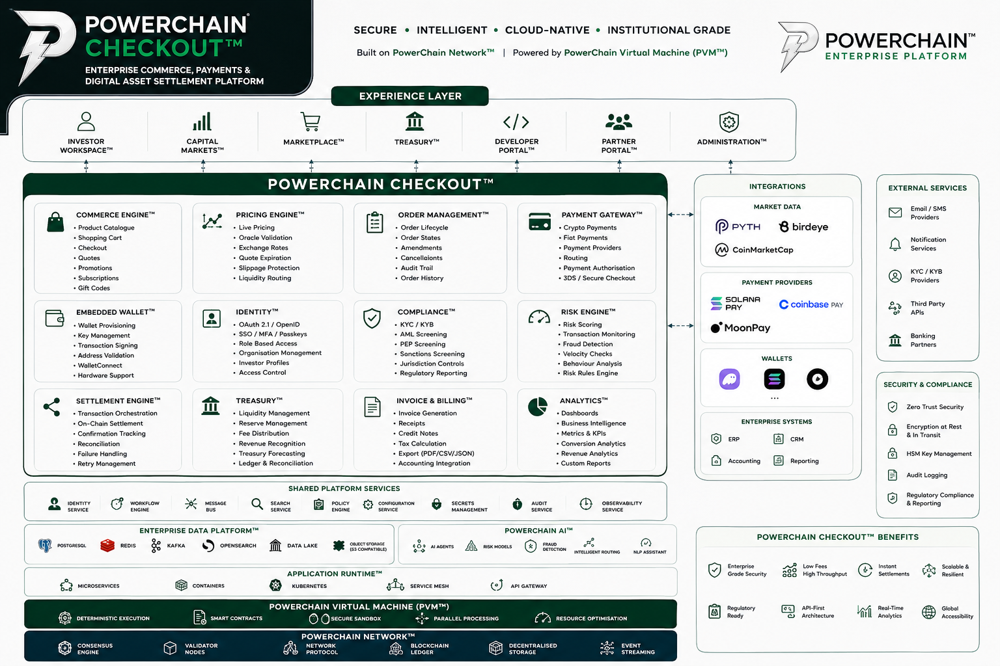

<p align="center">
  
</p>

<h1 align="center">
PowerChain Checkout™
</h1>

<p align="center">
Enterprise Commerce, Payments & Digital Asset Settlement Platform
</p>

<p align="center">

<strong>Version 1.0 Beta</strong>

<br>

Secure • Intelligent • Cloud Native • Institutional Grade

</p>

<p align="center">


</p>

---

# Overview

PowerChain Checkout™ is an enterprise-grade commerce, payment orchestration, and digital asset settlement platform built on the PowerChain Network™.

The platform enables businesses, institutions, merchants, developers, and financial organisations to accept payments, manage digital assets, issue invoices, settle transactions, and integrate blockchain-native financial infrastructure.

PowerChain Checkout combines:

- Enterprise payment processing
- Digital asset settlement
- Embedded wallets
- Merchant infrastructure
- Treasury management
- Real-time pricing
- Multi-chain interoperability
- Institutional security

Powered by:

- PowerChain Network™
- PowerChain Virtual Machine™ (PVM) - TBA
- PWRC Digital Asset Infrastructure

---

# Contents

- Overview
- Platform Capabilities
- Product Screens
- Architecture
- Checkout Workspace
- Embedded Wallet
- Pricing Engine
- Transaction Lifecycle
- API Platform
- Security
- Enterprise Integrations
- Technology Stack
- Repository Structure
- Documentation
- Roadmap
- Related Products

---

# Platform Capabilities

## Enterprise Checkout

PowerChain Checkout™ provides a complete payment experience for Web3 and enterprise commerce.

Features:

- Digital asset payments
- Stablecoin settlement
- Instant transaction confirmation
- Merchant checkout widgets
- Payment links
- Invoice payments
- Subscription-ready infrastructure


## Digital Asset Settlement

Supported assets:

- PWRC
- SOL
- USDC
- SUI


## Wallet Infrastructure

Supported wallets:

- Embedded Wallet
- Phantom
- Solflare
- Backpack
- WalletConnect


## Payment Providers

Integrated payment infrastructure:

- Solana Pay
- MoonPay
- Coinbase Pay


## Market Data Infrastructure

Real-time pricing:

- Pyth Network
- Birdeye
- CoinMarketCap


---

# Product Screens

# Dasboard UI/UX Experience

| User Dashboard | Investor Workspace |
|-----------|-------------------|
|  |  |


## Checkout Experience

| Checkout | Investor Workspace |
|-----------|-------------------|
|  |  |


## Invoice & Architecture

| Invoice System | Architecture |
|----------------|--------------|
|  |  |


---

# Enterprise Architecture

<p align="center">


</p>


PowerChain Checkout™ follows a cloud-native modular architecture designed for enterprise deployment.

Architecture layers:

```

```
                Users
                  |
          Checkout Interface
                  |
    --------------------------------
    Payment Orchestration Layer
    --------------------------------
      |              |             |
 Wallets        Pricing       Settlement
      |              |             |
 Solana        Pyth Oracle     PowerChain
      |
 Digital Assets
      |
 Treasury Layer
      |
 Enterprise Systems
```

```

---

# Checkout Workspace

The Checkout Workspace provides merchants and enterprises with:

- Payment creation
- Invoice management
- Transaction history
- Settlement tracking
- Customer management
- Reporting


---

# Embedded Wallet

PowerChain Checkout™ includes secure wallet infrastructure.

Capabilities:

- User onboarding without seed phrases
- Enterprise authentication
- Secure signing
- Wallet recovery
- Multi-device support


Authentication:

- OAuth 2.1
- OpenID Connect
- Passkeys


---

# Pricing Engine

Real-time pricing infrastructure powered by oracle-based market data.

Features:

- Asset conversion
- Exchange rate calculation
- Price impact monitoring
- Historical pricing
- Treasury valuation


---

# Transaction Lifecycle

```

Customer

|

Checkout Request

|

Payment Validation

|

Wallet Authorization

|

Blockchain Settlement

|

Treasury Processing

|

Merchant Confirmation

````

---

# API Platform

PowerChain Checkout™ provides developer APIs for:

- Payments
- Wallets
- Transactions
- Invoices
- Settlement
- Pricing
- Treasury


Example:

```http
POST /api/v1/payment/create

{
 "asset":"PWRC",
 "amount":"1000",
 "merchant":"example"
}
````

---

# Security

Security architecture includes:

## Identity

* OAuth 2.1
* OpenID Connect
* Passkeys
* Role-based access control

## Blockchain Security

* Multi-signature treasury controls
* Transaction monitoring
* Smart contract security
* Audit-ready infrastructure

## Infrastructure Security

* Kubernetes isolation
* Secrets management
* Encryption at rest
* Encryption in transit
* Zero-trust architecture

---

# Enterprise Integrations

## Identity

* OAuth 2.1
* OpenID Connect
* Passkeys

## Banking

* Treasury APIs
* Banking APIs

## ERP

* SAP
* Oracle
* Microsoft Dynamics

## CRM

* Salesforce
* HubSpot

## Messaging

* Email
* SMS
* Push Notifications

## Analytics

* PowerChain Analytics™
* OpenTelemetry
* Prometheus
* Grafana

---

# Repository Structure

```
checkout/

├── apps/
│   ├── checkout/
│   ├── dashboard/
│   └── admin/

├── packages/
│
├── services/
│   ├── payments/
│   ├── settlement/
│   ├── wallet/
│   └── pricing/

├── api/

├── docs/

├── assets/

├── scripts/

├── infrastructure/

├── kubernetes/

├── terraform/

└── README.md
```

---

# Technology Stack

| Layer          | Technology                           |
| -------------- | ------------------------------------ |
| Frontend       | React · Next.js · TypeScript         |
| UI             | Tailwind CSS · shadcn/ui             |
| Backend        | Node.js · Fastify · NestJS           |
| Database       | PostgreSQL                           |
| Cache          | Redis                                |
| Queue          | Kafka / Redpanda                     |
| Storage        | S3 Compatible Storage                |
| Search         | OpenSearch                           |
| Runtime        | PowerChain Virtual Machine™          |
| Network        | PowerChain Network™                  |
| Infrastructure | Kubernetes · Docker · Terraform      |
| Monitoring     | Prometheus · Grafana · OpenTelemetry |
| Authentication | OAuth 2.1 · OIDC · Passkeys          |

---

# Documentation

Complete documentation:

```
docs.powerchain.energy
```

Documentation includes:

* Architecture Specification
* API Reference
* Developer Guide
* Security Model
* Token Integration
* Enterprise Deployment Guide

---

# Roadmap

## Version 1.0 Beta

Completed:

* Enterprise Checkout
* Embedded Wallet
* Solana Pay Integration
* MoonPay Integration
* Coinbase Pay Integration
* Invoice Generation
* Treasury Settlement
* Live Pricing
* Pyth Oracle Integration
* Investor Dashboard

## Version 1.1

Planned:

* Shopify Plugin
* WooCommerce Plugin
* Magento Integration
* Salesforce Connector
* HubSpot Integration

## Version 2.0

Future:

* Subscription Billing
* Marketplace APIs
* Multi-chain Settlement
* Merchant Portal
* Enterprise POS
* Mobile SDK
* AI Fraud Detection

---

# Related Products

## PowerChain Payments™ (PowerPay)

Enterprise payment processing infrastructure.

## PowerChain Asset Management Platform™

Digital asset treasury and investment management platform.

## PowerChain Energy™

Renewable energy infrastructure and carbon market ecosystem.

## PWRC Token

Native utility asset powering the PowerChain ecosystem.

---

# Enterprise Platform

## PowerChain Enterprise Platform™

Enterprise digital infrastructure for:

* Digital Assets
* Capital Markets
* Renewable Energy
* Carbon Markets
* Commerce
* Artificial Intelligence

Built on:

**PowerChain Network™**

Powered by:

**PowerChain Virtual Machine™ (PVM)**

---

© 2026 PowerChain™
Enterprise Blockchain Infrastructure

```

This version is structured as a public-facing enterprise repository README suitable for developers, enterprise customers, infrastructure teams, and investors. It also leaves room for future additions such as API documentation, Kubernetes deployment guides, SDK documentation, and compliance sections.
```
