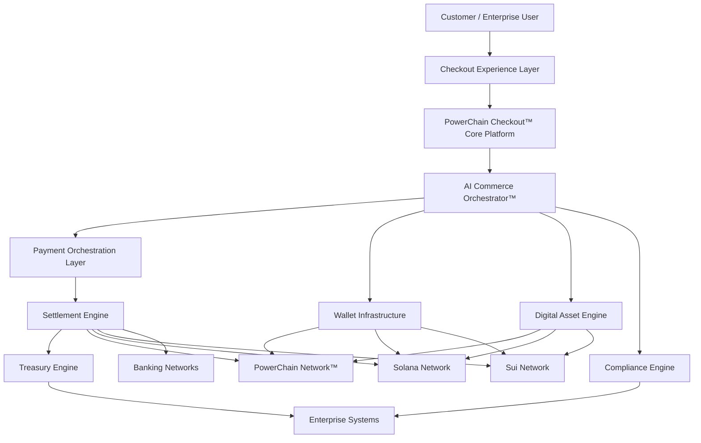
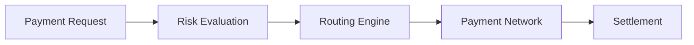
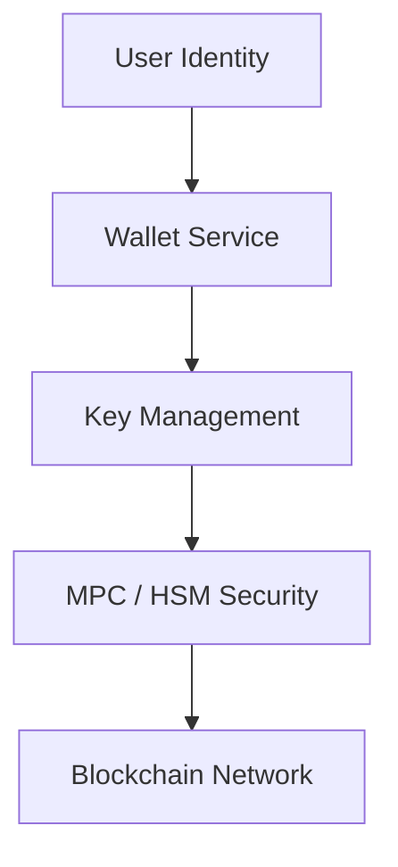
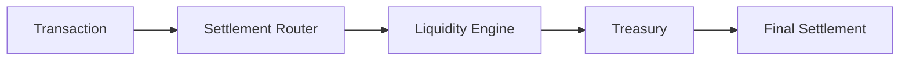
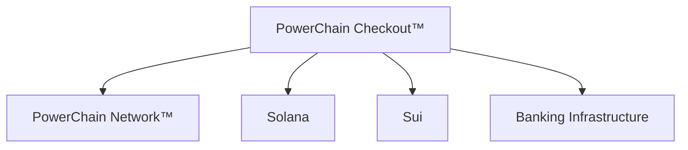
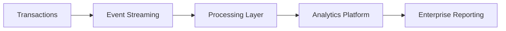
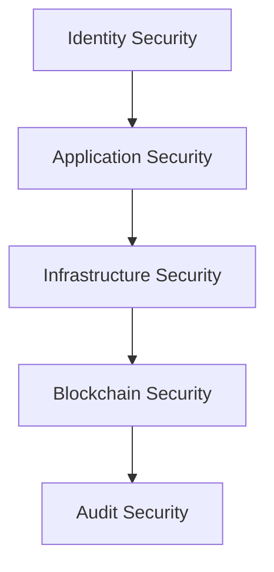
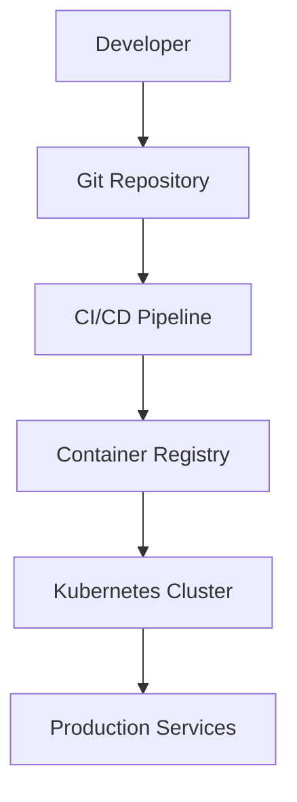

# PowerChain Checkout™

## Enterprise Architecture Specification v1.0 Beta

**Enterprise Commerce, Payment Orchestration & Programmable Settlement Architecture**

---

# 1. Architecture Overview

PowerChain Checkout™ is designed as a **cloud-native, modular financial infrastructure platform** that connects enterprise commerce applications, payment networks, blockchain ecosystems, digital assets, and treasury infrastructure through a unified transaction orchestration layer.

The architecture separates:

* User experience
* Commerce processing
* Payment execution
* Digital asset management
* AI decision systems
* Settlement infrastructure
* Enterprise operations
* Security controls

This enables organisations to deploy PowerChain Checkout™ as:

* Enterprise checkout infrastructure
* Embedded finance platform
* Digital asset settlement layer
* Tokenisation platform
* Treasury automation system

---

# 2. High-Level Architecture



---

# 3. Core Architecture Layers

---

# Layer 1 — Experience Layer

## Purpose

Provides customer and enterprise interaction interfaces.

Components:

* Hosted Checkout
* Embedded Checkout
* Checkout SDK
* Mobile SDK
* Payment Links
* QR Checkout
* Merchant Dashboard
* Enterprise Command Centre™

Architecture:

```text
Customer

 |

Checkout UI

 |

Checkout SDK

 |

API Gateway
```

---

# Layer 2 — API Gateway Layer

## Purpose

The API Gateway provides secure access to platform services.

Responsibilities:

* Request authentication
* API routing
* Rate limiting
* Request validation
* Version management
* Monitoring

Supported:

* REST APIs
* Webhooks
* Event APIs
* SDK integrations

Example:

```http
POST /v1/checkout/session

Authorization:
Bearer API_KEY
```

---

# Layer 3 — Commerce Platform Layer

## Purpose

Manages enterprise commerce workflows.

Services:

## Checkout Service

Handles:

* Checkout sessions
* Orders
* Payment requests
* Customer interactions

## Invoice Service

Handles:

* Invoice creation
* Payment tracking
* Settlement status

## Subscription Service

Handles:

* Recurring billing
* Usage-based billing
* Enterprise subscriptions

## Marketplace Service

Handles:

* Multi-vendor commerce
* Revenue sharing
* Seller settlements

---

# Layer 4 — Payment Orchestration Layer

## Purpose

Intelligently routes transactions across payment networks.



---

## Payment Routing Engine

Decision factors:

* Cost
* Liquidity
* Availability
* Settlement speed
* Compliance rules
* Merchant preferences

Example:

```text
Customer Payment

        |

Routing Engine

        |

Decision

USDC on Solana

        |

Settlement Complete
```

---

# Layer 5 — AI Commerce Orchestrator™

## Purpose

Provides intelligent automation across the transaction lifecycle.

Services:

## AI Routing Engine

Optimises:

* Payment rail selection
* Blockchain selection
* Settlement path

## Fraud Intelligence Engine

Analyses:

* Transaction behaviour
* Wallet activity
* Device signals
* Historical patterns

## Compliance Intelligence Engine

Supports:

* KYC
* KYB
* AML
* Sanctions screening
* Risk scoring

## Treasury Optimisation AI

Optimises:

* Liquidity
* Asset allocation
* Settlement timing

---

# Layer 6 — Wallet Infrastructure Layer

## Purpose

Provides enterprise-grade wallet capabilities.

Architecture:



---

## Wallet Features

* Embedded wallets
* Self-custody support
* Institutional custody
* MPC security
* Multi-signature wallets
* Recovery mechanisms
* Transaction policies

Supported:

### Solana

* Phantom
* Solflare
* Backpack
* Ledger

### Sui

* Slush
* Nightly
* Ledger

### Native

* PowerChain Wallet™

---

# Layer 7 — Digital Asset Layer

## Purpose

Manages programmable assets.

Supported assets:

## Native Assets

```
PWRC
SOL
SUI
```

## Stablecoins

```
USDC
USDT
EURC
```

## Enterprise Assets

```
Carbon Credit Tokens
Renewable Energy Tokens
Security Tokens
RWAs
Tokenised Funds
Utility Tokens
```

---

# Layer 8 — Settlement Layer

## Purpose

Provides programmable financial settlement.

Settlement types:

## Instant Settlement

Real-time execution.

## Scheduled Settlement

Enterprise batch processing.

## Net Settlement

Optimised reconciliation.

## Programmable Settlement

Automated financial workflows.

Architecture:



---

# Layer 9 — Treasury Infrastructure

## Purpose

Enterprise financial management.

Capabilities:

* Multi-asset treasury
* Stablecoin management
* Liquidity management
* Revenue distribution
* Financial reporting
* Asset reconciliation

---

# Layer 10 — Blockchain Connectivity Layer

## Supported Networks



---

# Layer 11 — Data Architecture

## Data Flow



---

## Data Components

* PostgreSQL
* Redis
* Event Streaming
* Data Warehouse
* Analytics Engine
* Audit Storage

---

# Layer 12 — Event Architecture

PowerChain Checkout™ uses event-driven infrastructure.

Events:

```
payment.created

payment.authorised

payment.completed

payment.failed

wallet.created

asset.transferred

settlement.completed

treasury.updated
```

Architecture:


---

# Layer 13 — Security Architecture

## Security Model

Based on:

* Zero Trust Architecture
* Defence in depth
* Least privilege access
* Continuous monitoring

Security layers:



---

## Controls

### Identity

* OAuth 2.1
* OIDC
* Passkeys
* MFA
* RBAC

### Infrastructure

* Encryption
* Secrets management
* Network isolation
* Container security

### Blockchain

* Multi-signature controls
* Transaction monitoring
* Address screening

---

# Layer 14 — Cloud Native Deployment

## Production Architecture



---

## Infrastructure Stack

| Layer          | Technology    |
| -------------- | ------------- |
| Runtime        | Kubernetes    |
| Containers     | Docker        |
| Infrastructure | Terraform     |
| Deployment     | Helm          |
| GitOps         | ArgoCD        |
| Monitoring     | Prometheus    |
| Dashboards     | Grafana       |
| Tracing        | OpenTelemetry |

---

# Layer 15 — Enterprise Operations

## Enterprise Command Centre™

Provides:

### Commerce Operations

* Orders
* Customers
* Billing
* Products

### Payment Operations

* Transactions
* Refunds
* Settlement

### Digital Asset Operations

* Wallets
* Tokens
* Asset activity

### Treasury Operations

* Balances
* Liquidity
* Reports

---

# 16. Architecture Principles

PowerChain Checkout™ follows:

## Modular Design

Independent scalable services.

## API First

Every capability exposed through secure APIs.

## Cloud Native

Designed for Kubernetes deployment.

## Multi-Network

Supports multiple blockchain and financial networks.

## Enterprise Security

Security integrated at every layer.

## Programmable Finance

Transactions become programmable workflows.

---

# PowerChain Checkout™ Architecture v1.0 Beta

**Enterprise Commerce Infrastructure**

Built on:

**PowerChain Network™**

Powered by:

**PowerChain Virtual Machine™ (PVM™)**

Designed for:

* Enterprise Commerce
* Digital Assets
* Tokenised Finance
* Renewable Energy Markets
* Carbon Markets
* Institutional Settlement

© 2026 PowerChain™
