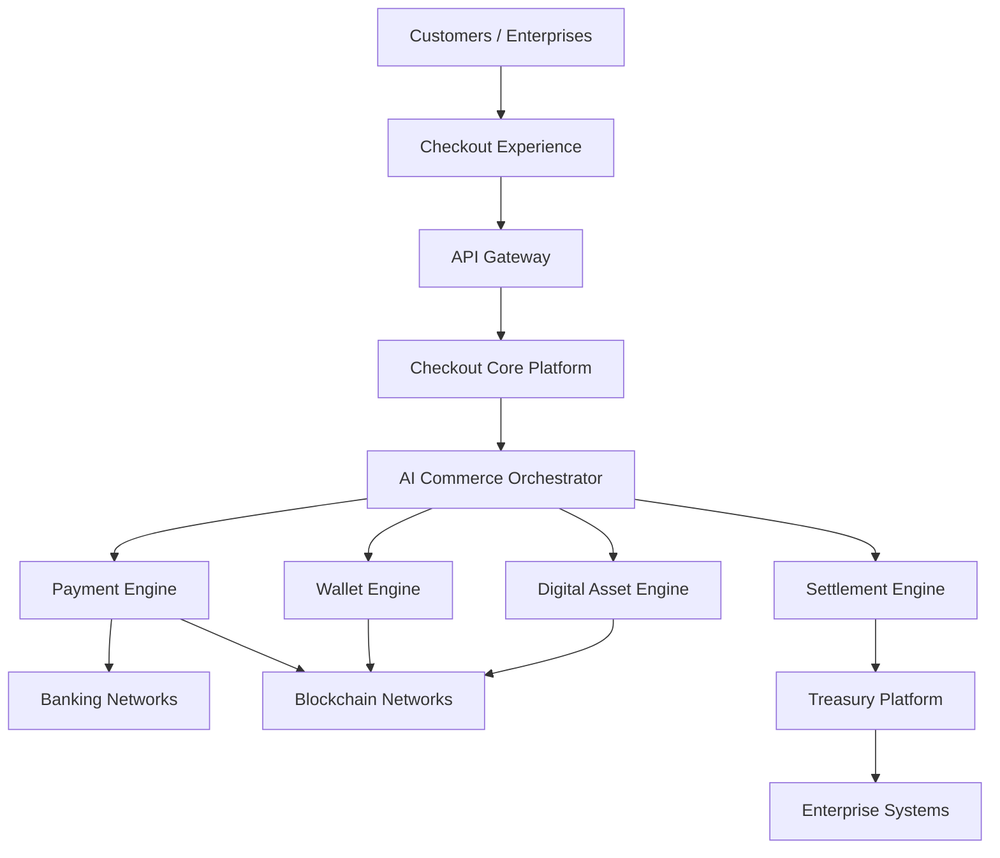
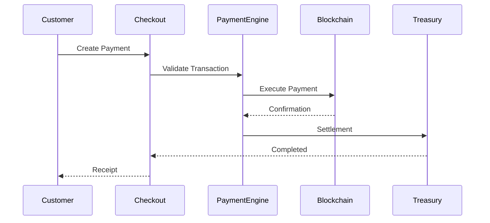
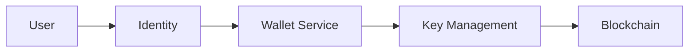
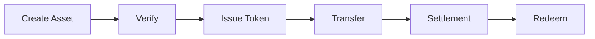
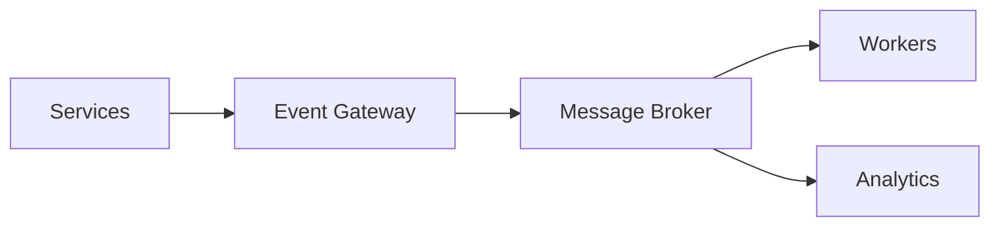
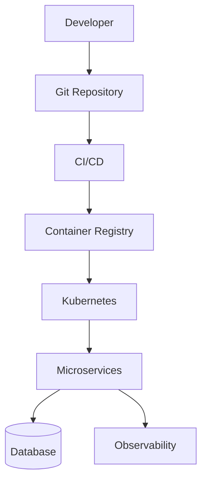

# PowerChain Checkout - Technical Documentation
Version 1.0 Beta

**Enterprise Commerce, Payment Orchestration & Programmable Settlement Platform**

---

# Documentation Index

```text
docs/

├── 01-overview
│   ├── introduction.md
│   ├── platform-capabilities.md
│   ├── terminology.md
│   └── principles.md
│
├── 02-architecture
│   ├── architecture-overview.md
│   ├── system-architecture.md
│   ├── service-architecture.md
│   ├── data-architecture.md
│   ├── event-architecture.md
│   └── network-architecture.md
│
├── 03-checkout-platform
│   ├── checkout-engine.md
│   ├── hosted-checkout.md
│   ├── embedded-checkout.md
│   ├── payment-links.md
│   └── invoice-system.md
│
├── 04-payment-platform
│   ├── payment-processing.md
│   ├── payment-routing.md
│   ├── payment-intents.md
│   ├── refunds.md
│   └── disputes.md
│
├── 05-wallet-platform
│   ├── wallet-architecture.md
│   ├── embedded-wallets.md
│   ├── custody-model.md
│   └── wallet-security.md
│
├── 06-digital-assets
│   ├── asset-framework.md
│   ├── tokenisation.md
│   ├── RWAs.md
│   ├── carbon-assets.md
│   └── energy-assets.md
│
├── 07-settlement
│   ├── settlement-engine.md
│   ├── treasury-system.md
│   ├── reconciliation.md
│   └── liquidity-management.md
│
├── 08-ai-platform
│   ├── orchestrator.md
│   ├── risk-engine.md
│   ├── fraud-engine.md
│   └── compliance-ai.md
│
├── 09-api
│   ├── api-overview.md
│   ├── authentication.md
│   ├── webhooks.md
│   ├── rate-limits.md
│   └── errors.md
│
├── 10-sdk
│   ├── javascript.md
│   ├── typescript.md
│   ├── react.md
│   ├── mobile.md
│   └── examples.md
│
├── 11-infrastructure
│   ├── kubernetes.md
│   ├── helm.md
│   ├── terraform.md
│   ├── deployment.md
│   └── monitoring.md
│
├── 12-security
│   ├── security-model.md
│   ├── encryption.md
│   ├── IAM.md
│   ├── HSM.md
│   └── incident-response.md
│
├── 13-compliance
│   ├── PCI-DSS.md
│   ├── SOC2.md
│   ├── ISO27001.md
│   ├── GDPR.md
│   └── AML-KYC.md
│
├── 14-enterprise
│   ├── SLA.md
│   ├── governance.md
│   ├── support.md
│   └── operations.md
│
└── 15-tokenisation
    ├── token-standard.md
    ├── issuance.md
    ├── lifecycle.md
    └── compliance.md
```

---

# 1. Platform Overview

## 1.1 Introduction

PowerChain Checkout™ is a programmable enterprise transaction infrastructure platform connecting:

* Commerce applications
* Payment providers
* Blockchain networks
* Digital assets
* Treasury systems
* Enterprise financial infrastructure

The platform provides a unified API layer for accepting, managing, settling and automating financial transactions.

---

# 1.2 Platform Mission

PowerChain Checkout™ transforms payment infrastructure from a transaction processor into an intelligent financial operating system.

The platform enables:

* Global commerce
* Embedded finance
* Digital asset settlement
* Tokenised financial markets
* Renewable energy markets
* Carbon credit infrastructure
* Enterprise treasury automation

---

# 2. Enterprise Architecture

## 2.1 Logical Architecture



---

# 3. Microservice Architecture

PowerChain Checkout™ uses domain-based services.

## Core Services

| Service              | Responsibility       |
| -------------------- | -------------------- |
| Checkout Service     | Transaction creation |
| Payment Service      | Payment execution    |
| Wallet Service       | Wallet management    |
| Asset Service        | Token management     |
| Pricing Service      | Market pricing       |
| Settlement Service   | Settlement execution |
| Treasury Service     | Financial operations |
| Identity Service     | Authentication       |
| Compliance Service   | Risk controls        |
| Notification Service | Communication        |

---

# 4. Checkout Engine Specification

## 4.1 Checkout Session

A checkout session represents a customer transaction workflow.

Example:

```json
{
"id":"chk_123456",
"merchant":"merchant_id",
"asset":"USDC",
"amount":"100",
"status":"pending"
}
```

---

## Checkout States

```text
CREATED

↓

AUTHENTICATING

↓

PAYMENT_PENDING

↓

PROCESSING

↓

SETTLED

↓

COMPLETED
```

---

# 5. Payment Architecture

## Payment Flow



---

# 6. Wallet Architecture

## Embedded Wallet Model



---

Security:

* MPC signing
* HSM integration
* Policy controls
* Recovery workflows
* Transaction approval rules

---

# 7. Digital Asset Architecture

## Asset Classes

### Native Assets

* PWRC
* SOL
* SUI

### Stable Assets

* USDC
* USDT
* EURC

### Enterprise Assets

* Carbon Credits
* Renewable Energy Certificates
* Security Tokens
* Real World Assets
* Tokenised Funds

---

# 8. Tokenisation Framework

## Asset Lifecycle



---

# 9. AI Commerce Orchestrator™

## Components

### Routing Intelligence

Optimises:

* Network selection
* Payment method
* Settlement path
* Transaction cost

### Risk Intelligence

Evaluates:

* Identity
* Behaviour
* Wallet history
* Transaction patterns

### Compliance Intelligence

Supports:

* AML
* KYC
* KYB
* Screening
* Monitoring

---

# 10. API Platform

## API Principles

* REST-first
* Versioned APIs
* OAuth authentication
* Webhooks
* Idempotency support
* Enterprise rate limiting

---

## API Domains

```
/checkout

/payments

/wallets

/assets

/settlements

/treasury

/customers

/webhooks
```

---

# 11. Event Platform

## Event Bus



---

Events:

```
checkout.created

payment.completed

wallet.updated

asset.issued

settlement.completed
```

---

# 12. Cloud Infrastructure

## Production Architecture



---

Technology:

* Kubernetes
* Docker
* Terraform
* Helm
* ArgoCD
* Prometheus
* Grafana
* OpenTelemetry

---

# 13. Security Architecture

## Security Layers

```text
Identity Security

↓

Application Security

↓

Infrastructure Security

↓

Blockchain Security

↓

Audit Security
```

---

Controls:

* Zero Trust
* Encryption
* RBAC
* Secrets management
* HSM
* Audit logging
* Monitoring

---

# 14. Enterprise Compliance

Supported frameworks:

* PCI DSS
* SOC 2 Type II
* ISO 27001
* GDPR
* AML
* KYC
* PSD2
* ISO 20022

---

# 15. Developer Platform

Supported SDKs:

* JavaScript
* TypeScript
* React
* React Native
* Flutter
* Python
* Go
* Java
* .NET

Developer resources:

* API reference
* SDK examples
* Sandbox
* Webhook testing
* Deployment guides

---

# 16. Enterprise Operations

## Command Centre™

Provides:

* Transaction monitoring
* Merchant management
* Treasury analytics
* Compliance reporting
* System health

---

# 17. Reliability Engineering

Targets:

## Availability

99.99% platform availability

## Architecture

* Multi-region deployment
* Automated failover
* Backup systems
* Disaster recovery
* Observability

---

# 18. Version Information

```
Product:

PowerChain Checkout™

Version:

1.0 Beta

Status:

Public Beta

Architecture:

Enterprise Cloud Native

Network:

PowerChain Network™

Runtime:

PowerChain Virtual Machine™
```

---

# PowerChain Checkout™

## Enterprise Transaction Infrastructure for the Programmable Economy

Built for:

* Commerce
* Digital Assets
* Tokenisation
* Energy Markets
* Carbon Markets
* Institutional Finance

© 2026 PowerChain™
