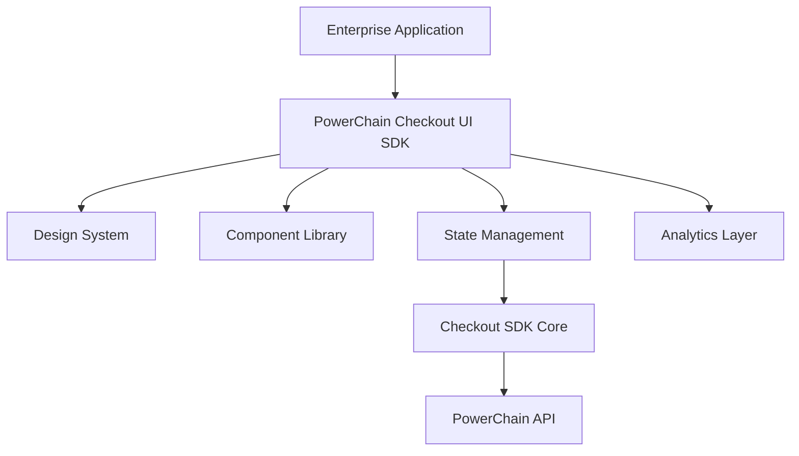

# PowerChain Checkout™ UI SDK

### `packages/sdk/checkout/ui/`

# Enterprise Commerce Interface Framework
Version 1.0 Beta

---

<p align="center">

Enterprise-grade UI infrastructure for:

**Payments • Digital Assets • Tokenisation • Settlement • Commerce**

</p>

---

# Overview

The **PowerChain Checkout™ UI SDK** provides a complete enterprise interface layer for building modern payment and digital asset experiences.

The SDK abstracts complex financial workflows into reusable, secure and customisable UI components.

Designed for:

* Enterprise commerce platforms
* Fintech applications
* Marketplaces
* Digital asset platforms
* Tokenised finance applications
* Renewable energy marketplaces
* Carbon credit exchanges

---

# Core Capabilities

## Checkout Experience

Complete payment interface:

* Hosted checkout
* Embedded checkout
* Headless checkout
* Express checkout
* One-click payments
* Payment links
* QR checkout
* Invoice checkout
* Subscription checkout

---

## Payment Experience

Supported payment interfaces:

### Traditional Payments

* Card payments
* Apple Pay
* Google Pay
* Open Banking
* SEPA
* ACH
* Bank Transfer

### Digital Asset Payments

* PWRC
* SOL
* SUI
* USDC
* USDT
* EURC

---

## Wallet Experience

Wallet UI infrastructure:

* Embedded wallet creation
* Wallet connection
* Wallet selection
* Transaction approval
* Balance display
* Asset management
* Signing flows

Supported:

* PowerChain Wallet™
* Phantom
* Solflare
* Backpack
* WalletConnect
* Ledger
* Sui wallets

---

# Enterprise UI Architecture



---

# Repository Structure

```text
packages/sdk/checkout/ui/

├── src/

│
├── design-system/
│
│   ├── tokens/
│   │   ├── colors.ts
│   │   ├── typography.ts
│   │   ├── spacing.ts
│   │   ├── shadows.ts
│   │   └── motion.ts
│
├── components/
│
│   ├── checkout/
│   │   ├── Checkout.tsx
│   │   ├── CheckoutHeader.tsx
│   │   ├── CartSummary.tsx
│   │   ├── CustomerDetails.tsx
│   │   └── CheckoutComplete.tsx
│
│   ├── payments/
│   │   ├── PaymentSelector.tsx
│   │   ├── PaymentMethod.tsx
│   │   ├── PaymentButton.tsx
│   │   ├── PaymentStatus.tsx
│   │   └── Receipt.tsx
│
│   ├── wallet/
│   │   ├── WalletConnect.tsx
│   │   ├── WalletModal.tsx
│   │   ├── WalletBalance.tsx
│   │   └── SigningDialog.tsx
│
│   ├── assets/
│   │   ├── TokenSelector.tsx
│   │   ├── AssetCard.tsx
│   │   ├── PriceQuote.tsx
│   │   └── NetworkBadge.tsx
│
│   ├── settlement/
│   │   ├── SettlementStatus.tsx
│   │   ├── SettlementTimeline.tsx
│   │   └── SettlementReceipt.tsx
│
│   ├── compliance/
│   │   ├── KYCBanner.tsx
│   │   ├── AMLStatus.tsx
│   │   └── VerificationFlow.tsx
│
│   ├── dashboard/
│   │   ├── RevenueCard.tsx
│   │   ├── TransactionTable.tsx
│   │   ├── TreasuryPanel.tsx
│   │   └── AssetPortfolio.tsx
│
├── providers/

│   ├── CheckoutProvider.tsx
│   ├── ThemeProvider.tsx
│   ├── LocaleProvider.tsx
│   └── SecurityProvider.tsx
│
├── hooks/

│   ├── useCheckout.ts
│   ├── usePayment.ts
│   ├── useWallet.ts
│   ├── useAssets.ts
│   └── useSettlement.ts
│
├── analytics/

├── localisation/

├── stories/

└── tests/
```

---

# Installation

```bash
npm install @powerchain/checkout-ui
```

---

# Provider Setup

```tsx
import {

CheckoutProvider

}

from "@powerchain/checkout-ui";


export default function App(){

return (

<CheckoutProvider

theme="powerchain"

environment="production"

>

<Application />

</CheckoutProvider>

)

}
```

---

# Complete Checkout Component

```tsx
import {

Checkout

}

from "@powerchain/checkout-ui";


<Checkout

sessionId="chk_001"

/>
```

Provides:

* Order summary
* Customer information
* Payment selection
* Wallet connection
* Asset selection
* Confirmation
* Receipt

---

# Headless Checkout

For custom enterprise experiences:

```tsx
const {

createCheckout,

confirmPayment

}

=
useCheckout();
```

Example:

```tsx
<button

onClick={confirmPayment}

>

Complete Payment

</button>
```

---

# Payment Components

## Payment Selector

```tsx
<PaymentSelector

methods={[

"card",

"apple_pay",

"usdc",

"pwrc"

]}

/>
```

---

# Asset Components

## Token Selection

```tsx
<TokenSelector

assets={[

"PWRC",

"USDC",

"SOL"

]}

/>
```

Displays:

* Token icon
* Balance
* Network
* Price
* Fees
* Settlement estimate

---

# Settlement Interface

```tsx
<SettlementTimeline

transactionId="tx_001"

/>
```

Lifecycle:

```text
Created

↓

Authorised

↓

Processing

↓

Blockchain Confirmation

↓

Settled

↓

Completed
```

---

# Merchant Dashboard UI

## Transaction Analytics

```tsx
<TransactionTable

merchant="enterprise_001"

/>
```

Shows:

* Payment activity
* Settlement status
* Asset movements
* Network information
* Fees

---

# Treasury Dashboard

```tsx
<TreasuryPanel

currency="USDC"

/>
```

Provides:

* Treasury balance
* Liquidity
* Revenue
* Settlement history
* Asset allocation

---

# White Label System

Enterprise customers can customise:

## Branding

* Logo
* Colours
* Typography
* Icons

## Layout

* Checkout flow
* Payment ordering
* Component visibility

## Compliance

* Required verification steps
* Risk notices
* Legal messages

Example:

```typescript
const enterpriseTheme = {

brand:

"Customer Brand",

primary:

"#0F5A3D",

radius:

"16px"

}
```

---

# Localisation

Supported:

```text
en-GB

fi-FI

de-DE

fr-FR

es-ES

ja-JP

zh-CN
```

Features:

* Currency formatting
* Date formatting
* Regional payment methods
* Compliance text

---

# Analytics Events

```typescript
checkout_opened

payment_selected

wallet_connected

asset_selected

payment_started

payment_completed

settlement_completed

```

Compatible with:

* OpenTelemetry
* Enterprise analytics systems
* PowerChain Analytics™

---

# Security Architecture

UI security principles:

* No private key exposure
* Secure transaction signing
* Tokenised payment information
* PCI-aware architecture
* Secure iframe support
* CSP compatibility
* Session protection

---

# Accessibility

Compliance:

* WCAG 2.2 AA
* Keyboard navigation
* Screen reader support
* ARIA components
* Reduced motion
* High contrast

---

# Framework Support

## v1.0 Beta

Supported:

✅ React
✅ Next.js
✅ TypeScript
✅ Web Components

## Future

v1.1:

* React Native
* Flutter
* Mobile checkout SDK

v2.0:

* Vue
* Angular
* Enterprise UI Builder

---

# Developer Experience

Included:

* TypeScript definitions
* Storybook documentation
* Component playground
* Testing utilities
* Enterprise examples

Run:

```bash
npm run storybook
```

---

# Package Metadata

```json
{
"name":"@powerchain/checkout-ui",
"version":"1.0.0-beta",
"description":
"Enterprise UI framework for PowerChain Checkout",
"license":
"Apache-2.0"
}
```

---

# Roadmap

## v1.0 Beta

Completed:

✓ Checkout UI
✓ Payment UI
✓ Wallet UI
✓ Asset UI
✓ Settlement UI
✓ Dashboard Components
✓ Theme Engine
✓ Localisation

## v1.1

Planned:

* Merchant Portal UI
* Investor Portal UI
* Token Sale UI
* Carbon Market UI
* Energy Market UI

## v2.0

Future:

* AI Commerce Interface
* Autonomous Payment Assistant
* Enterprise Financial Command Centre

---

# PowerChain Checkout™ UI SDK

## Version 1.0 Beta

Enterprise interface infrastructure powering:

**Global Commerce**
**Digital Payments**
**Tokenised Assets**
**Programmable Settlement**

Built on:

**PowerChain Checkout™**

Powered by:

**PowerChain Network™**

© 2026 PowerChain™
